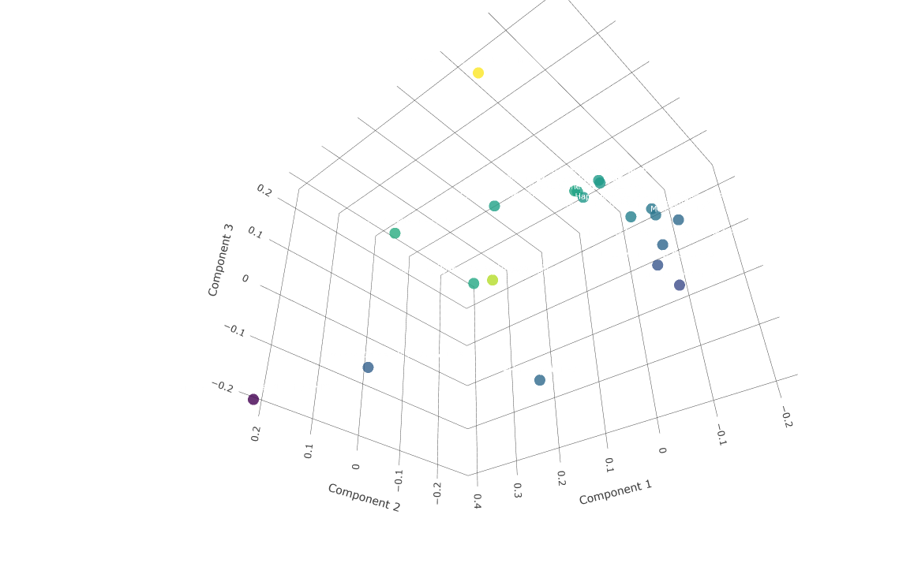

# Gemini Embeddings 2 Music Classifier 🎵🤖



> **ENG:** *3D representation of the acoustic spectrum using PCA. The mathematics behind the embeddings calculates the distance between audio vectors. Songs with similar genres and feelings naturally form visible clusters, as seen by the distinct groupings on the left and right of the graph.*

> **PT-BR:** *Representação 3D do espectro acústico usando PCA. A matemática dos embeddings calcula a distância entre os vetores de áudio. Músicas de gêneros e "feelings" parecidos naturalmente formam agrupamentos visíveis, como os blocos isolados à esquerda e à direita do gráfico.*

*[Read in English](#english-version) | [Ler em Português](#versão-em-português)*

---

## English Version

A desktop application built with Electron.js that uses Google's Gemini Embeddings 2 API to analyze, classify, and compare musical similarity (acoustics, mood, rhythm) between `.mp3` audio files on your computer.

### 🎯 Objective

The main goal of this project is to demonstrate how Embedding AI models (in this case, Gemini Embeddings 2) can "listen" and "understand" multimedia files. By transforming complex audio into mathematical matrices (Embedding Vectors), we can use simple geometric calculations (like Cosine Similarity) to find similar songs quickly and efficiently.

### 🧠 How Does the Magic Work? (The Architecture)

The Gemini model has size limits for audio processing. To analyze full songs, we created a smart **Mean Pooling (Mathematical Average)** system:

1. **Smart Slicing:** Using `ffmpeg`, we divide each `.mp3` file into smaller chunks of 80 seconds.
2. **Queue Processing (Pool):** The frontend controls an asynchronous queue, sending a maximum of 3 chunks simultaneously to the Google API to avoid overloading API limits.
3. **Vector Extraction:** Gemini "listens" to the chunk and returns a multidimensional vector representing the mood, rhythm, beat, and style of that piece of music.
4. **Mean Pooling:** The Backend sums all the vectors of the song and calculates their arithmetic mean. The result is a single vector (a definitive digital fingerprint) that represents the global qualities of the entire song!
5. **Cosine Comparisons:** With these "fingerprints" saved in a local database (`embeddings.json`), when you want to compare which song is most similar to another, the system doesn't listen to them again; it just measures the distance and angle (Cosine Similarity) between the two saved fingerprints to generate a Score in %!

### 🚀 How to Run the Project for the First Time

#### Prerequisites
Before you begin, you need to have the following tools installed on your computer:
- **Node.js** (and the npm package manager)
- A valid **Gemini API Key**.

*Note: You **do not** need to manually install FFmpeg on your OS, the project already downloads pre-compiled binaries as an NPM dependency.*

#### Step-by-Step Installation

1. **Clone the repository:**
   ```bash
   git clone https://github.com/augustolpq/gemini-embeddings-2-music-classifier.git
   cd gemini-embeddings-2-music-classifier
   ```

2. **Install project dependencies:**
   This will download Electron, Google AI libraries, and the embedded FFmpeg binaries.
   ```bash
   npm install
   ```

3. **Start the Application:**
   ```bash
   npm start
   ```

4. **Getting Started:**
   - On the app's home screen, paste your **Gemini API Key** into the indicated field and click "Save".
   - Click "Browse .mp3 files" and select some songs.
   - The system will slice, send, generate the vectors, and clean up automatically and safely.
   - Once processing is complete, click the button to "Launch AI", select the reference song, and see the similarity ranking in real-time!

### 📦 Main Libraries

- `electron`: Framework for creating the Desktop interface.
- `@google/genai`: Official SDK for interaction with Gemini AI.
- `fluent-ffmpeg`: Bridge library to manipulate media files via node.
- `@ffmpeg-installer/ffmpeg` and `@ffprobe-installer/ffprobe`: "Standalone" binaries that make audio cropping work out-of-the-box, without complex settings for the end-user.
- `ml-pca`: Machine Learning library for JavaScript, used to perform Principal Component Analysis (PCA) and reduce 768 dimensions to 3.
- `plotly.js`: Advanced data visualization library used to render the interactive 3D acoustic spectrum.

---
*Made in an educational way to explore the boundary between music and AI! 🎸*

---

## Versão em Português

Um aplicativo desktop construído com Electron.js que utiliza a API Gemini Embeddings 2 do Google para analisar, classificar e comparar o grau de similaridade musical (acústica, humor, ritmo) entre arquivos de áudio `.mp3` no seu computador.

### 🎯 Objetivo

O objetivo principal deste projeto é demonstrar como modelos de IA Embeddings (neste caso, o Gemini Embeddings 2) podem "ouvir" e "entender" arquivos multimídia. Ao transformar áudios complexos em matrizes matemáticas (Vetores de Embedding), podemos utilizar cálculos geométricos simples (como Similaridade de Cosseno) para encontrar músicas parecidas de forma rápida e eficiente.

### 🧠 Como Funciona a Mágica? (A Arquitetura)

O modelo Gemini possui limites de tamanho para o processamento de áudio. Para analisar músicas completas, criamos um sistema inteligente de **Mean Pooling (Média Matemática)**:

1. **Fatiamento Inteligente:** Usando `ffmpeg`, dividimos cada arquivo `.mp3` em pedaços (chunks) menores de 80 segundos de duração.
2. **Processamento em Fila (Pool):** O frontend controla uma fila assíncrona, enviando no máximo 3 chunks simultâneos para a API do Google para não sobrecarregar os limites da API.
3. **Extração de Vetores:** O Gemini "ouve" o chunk e devolve um vetor multidimensional que representa o humor, ritmo, batida e estilo daquele pedaço de música.
4. **Mean Pooling:** O Backend soma todos os vetores da música e tira a média aritmética deles. O resultado é um único vetor (uma impressão digital definitiva) que representa as qualidades globais de toda a música!
5. **Comparações de Cosseno:** Com essas "impressões digitais" salvas em um banco de dados local (`embeddings.json`), quando você deseja comparar qual música se parece mais com outra, o sistema não escuta elas de novo; ele apenas mede a distância e o ângulo (Cosine Similarity) entre as duas impressões digitais salvas para gerar um Score em %!

### 🚀 Como Rodar o Projeto Pela Primeira Vez

#### Pré-requisitos
Antes de começar, você precisa ter as seguintes ferramentas instaladas no seu computador:
- **Node.js** (e o gerenciador de pacotes npm)
- Uma **Chave de API do Gemini** (Gemini API Key) válida.

*Nota: Você **não** precisa instalar o FFmpeg manualmente no seu sistema operacional, o projeto já baixa binários pré-compilados como dependência do NPM.*

#### Passo a Passo da Instalação

1. **Clone o repositório:**
   ```bash
   git clone https://github.com/augustolpq/gemini-embeddings-2-music-classifier.git
   cd gemini-embeddings-2-music-classifier
   ```

2. **Instale as dependências do projeto:**
   Isso fará o download do Electron, bibliotecas do Google AI e os binários embutidos do FFmpeg.
   ```bash
   npm install
   ```

3. **Inicie a Aplicação:**
   ```bash
   npm start
   ```

4. **Começando a usar:**
   - Na tela inicial do app, cole a sua **Chave de API do Gemini** no campo indicado e clique "Salvar".
   - Clique em "Procurar arquivos .mp3" e selecione algumas músicas.
   - O sistema irá fatiar, enviar, gerar os vetores e limpar tudo automaticamente de forma segura.
   - Assim que o processamento terminar, clique no botão para "Lançar a IA", selecione a música de referência e veja o ranking de similaridade em tempo real!

### 📦 Bibliotecas Principais

- `electron`: Framework para criação da interface Desktop.
- `@google/genai`: SDK Oficial para a interação com a IA do Gemini.
- `fluent-ffmpeg`: Biblioteca ponte para manipular arquivos de mídia via node.
- `@ffmpeg-installer/ffmpeg` e `@ffprobe-installer/ffprobe`: Binários "standalone" que fazem o corte dos áudios funcionarem out-of-the-box, sem configurações complexas para o usuário final.
- `ml-pca`: Biblioteca de Machine Learning para JavaScript, usada para realizar a Análise de Componentes Principais (PCA) e reduzir as 768 dimensões matemáticas para apenas 3.
- `plotly.js`: Biblioteca avançada de visualização de dados, usada para renderizar o espectro acústico 3D de forma interativa no frontend.

---
*Feito de forma didática para explorar o limite entre a música e a IA! 🎸*
